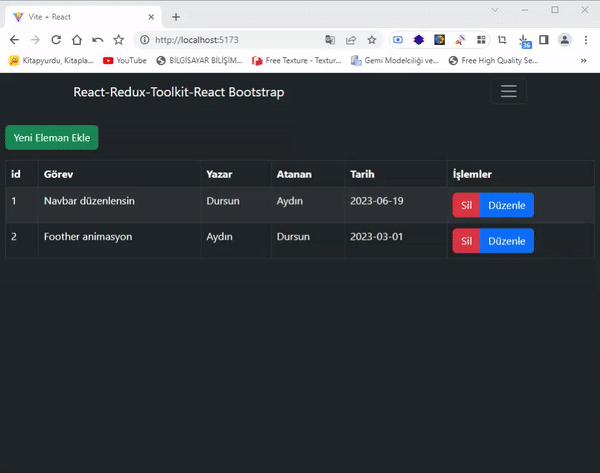

<h1># Proje Adı</h1> 
<h1>Görev Yönetimi Uygulaması</h1> 

<h3>Bu proje, CRUD (Create, Read, Update, Delete) işlemlerini gerçekleştiren bir görev yönetimi uygulamasıdır.</h3> 

<h1>## Proje Açıklaması</h1> 

Bu proje, kullanıcıların görevleri eklemelerini, düzenlemelerini ve silmelerini sağlayan basit bir görev yönetimi uygulamasıdır. Kullanıcılar, görevlerin başlık, yazar, atanan kişi ve son teslim tarihi gibi bilgilerini girerek görevleri takip edebilirler.
 

<h1>## Kullanılan Teknolojiler</h1> 

- React: Kullanıcı arayüzünü oluşturmak için React kullanılmıştır. 
- Redux Toolkit: Veri yönetimi için Redux Toolkit kullanılmıştır. 
- React-Bootstrap: Tasarım bileşenleri ve stil için React-Bootstrap kullanılmıştır. 
- React Router: Uygulama içinde sayfalar arası yönlendirme için React Router kullanılmıştır. 

<h1>## Yapılan İşlemler</h1> 

1. Görev Ekleme: Kullanıcılar yeni görevler ekleyebilirler. Görevlerin başlık, yazar, atanan kişi ve son teslim tarihi gibi bilgileri girilir. Eklenen görevler listelenir. 
2. Görev Silme: Kullanıcılar listedeki görevleri silebilirler. Silmek istedikleri göreve basit bir buton tıklamasıyla erişebilirler. 
3. Görev Düzenleme: Kullanıcılar mevcut görevleri düzenleyebilirler. Düzenleme işlemi için bir modal penceresi açılır ve kullanıcılar bilgileri güncelleyebilirler.
 

<h1>## Tasarım Şekli</h1> 

Proje, Bootstrap tabanlı bir tasarım kullanılarak oluşturulmuştur. Veri tablosu, düzenleme ve silme butonlarıyla birlikte görevleri listeler. Kullanıcılar, yeni görev ekleme için açılır bir modal penceresi kullanabilirler. Tasarım basit ve kullanıcı dostudur.
 

<h1>## Nasıl Çalıştığı</h1> 

1. Projeyi yerel makinenize klonlayın. 
2. Klonladığınız dizine terminal üzerinden gidin.
3. Terminalde `npm install` komutunu çalıştırarak projenin bağımlılıklarını yükleyin. 
4. Terminalde `npm start` komutunu çalıştırarak projeyi başlatın. 
5. Tarayıcınızda `http://localhost:3000` adresine gidin. 
6. Proje, tarayıcınızda çalışacaktır.
 

<h1>## Projenin Sonucu</h1>

Bu proje, kullanıcıların görevleri eklemelerine, düzenlemelerine ve silmelerine olanak tanır. Kullanıcılar, görevlerin başlık, yazar, atanan kişi ve son teslim tarihi gibi bilgilerini girebilirler. Bu sayede, görevleri takip etmek ve yönetmek kolaylaşır. Kullanıcı dostu bir uygulamadır.

<h1>Canlı Önizleme</h1>

